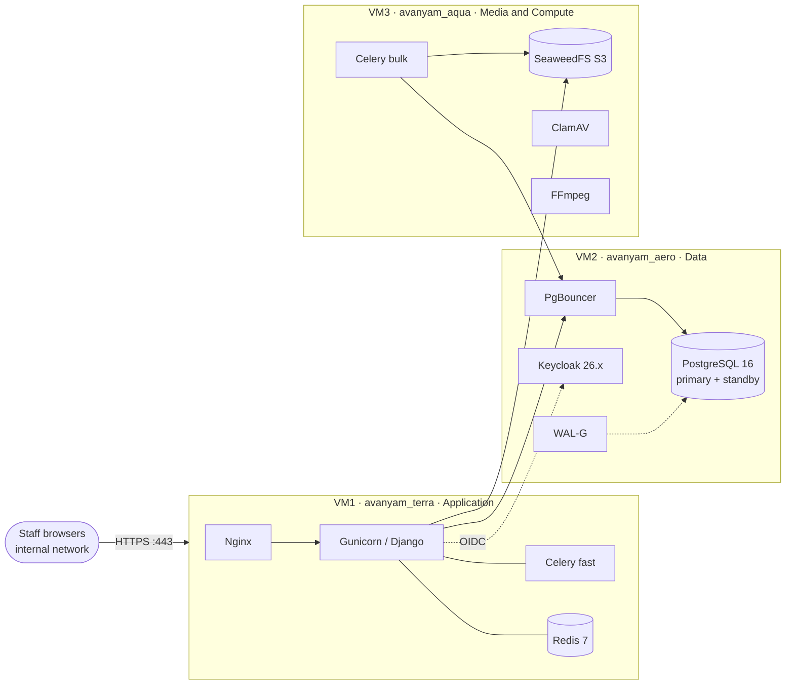

<div align="center">

# Avanyam

### Internal Learning & Capability Building Platform

A secure, auditable Learning Management System and competency-mapping platform for a single organization, deployed on the internal network only.


[Overview](#overview) ·
[Key Capabilities](#key-capabilities) ·
[Architecture](#architecture) ·
[Deployment Topology](#deployment-topology) ·
[Getting Started](#getting-started) ·
[Roadmap](#roadmap)

</div>

---

## Table of Contents

- [Overview](#overview)
- [Key Capabilities](#key-capabilities)
- [Roles](#roles)
- [Architecture](#architecture)
- [Deployment Topology](#deployment-topology)
- [Repository Layout](#repository-layout)
- [Getting Started](#getting-started)
- [Testing](#testing)
- [Known Deployment Gaps](#known-deployment-gaps)
- [Deployment Guidelines](#deployment-guidelines)
- [Roadmap](#roadmap)
- [Out of Scope for v1](#out-of-scope-for-v1)
- [License](#license)

---

## Overview

Avanyam replaces spreadsheet-and-email-driven training coordination with a single, auditable system. It implements the **CAPACITY CONNECT** brief (*Digital Capacity Building and Learning Management Portal*).

> **Source of truth.** [`avanyam_intro.txt`](avanyam_intro.txt) is the authoritative engineering specification. Where it conflicts with the management-level [`avanyam_brief.txt`](avanyam_brief.txt), the engineering brief wins.

---

## Key Capabilities

Three capabilities set Avanyam apart from a generic LMS.

### 1. Competency Mapping

A framework maps **`SUBJECT → required COMPETENCY → TRAINER`**, backed by evidence and admin-verified proficiency claims.

- A pure scoring function ranks eligible trainers per subject and surfaces verified gaps.
- Every recommendation persists an explainable score breakdown, so there is no black box.

### 2. Compliance-Grade Assessment

| Guarantee | How it is achieved |
|---|---|
| Immutable question paper | Snapshotted at attempt start; later edits can never corrupt an in-flight or historical attempt |
| No answer leakage | Correct answers are never sent to the client |
| Trusted timing | Server-authoritative only |
| Fair delivery | Option order shuffled per attempt |
| Safe retries | Submits are idempotent |
| Full traceability | Every state transition is audit-logged |

### 3. Signup Without Uncontrolled Access

Registration is open to staff, but an account is **inert until an administrator approves it**.

- Identity (corporate OIDC/LDAP, where available) is strictly separated from authorization (PostgreSQL).
- Neither directory membership nor signup can self-activate a role. Approval is always explicit.

---

## Roles

| Role | Scope |
|---|---|
| **Trainee** | Profile, course enrollment, learning content, MCQ assessments, feedback |
| **Trainer** | Profile, questionnaire authoring, own-content library, cohort monitoring |
| **Admin** | User approval, role management, dashboards, homepage feed publishing |

Multi-role users are supported. A senior engineer who also trains holds `TRAINEE + TRAINER`, with a session-scoped active-role switcher.

---

## Architecture

### Modular Monolith

One deployable, one database, with Django apps as bounded contexts. This is justified by single-organization scale, a small team, and the transactional consistency required across **enrollment → progress → certificate**. Microservices would multiply operational surface for no benefit.

> A "monolith" here means one codebase, one database, one artifact, **not one machine**. What is split across three VMs is the *processes*, not the application. The seams for future extraction (video transcoding, report aggregation, notification fan-out) are already isolated as separate processes.

### Layering

Each app follows the same layered structure:

| Layer | Responsibility |
|---|---|
| `api/` | Thin DRF controllers. No business logic, no QuerySets |
| `service/` | Orchestration and transaction boundaries |
| `domain/` | **Pure logic.** No ORM, no request, no settings |
| `repositories/` | The only layer that writes QuerySets |
| `policies.py` | Pure `can(user, action, obj)` authorization, exhaustively tested |

A small typed event bus decouples assessment → certification → announcements without circular imports.

### Tech Stack

| Area | Technology |
|---|---|
| Language and framework | Python 3.11 · Django 5.2 LTS · Django REST Framework |
| Data | PostgreSQL 16 · Redis 7 · PgBouncer · WAL-G |
| Async | Celery (`fast` and `bulk` queues) |
| Identity | Keycloak 26.x (OIDC) |
| Media | SeaweedFS (S3-compatible) · ClamAV · FFmpeg |
| Edge | Nginx · Gunicorn |
| Observability | structlog · OpenTelemetry · Prometheus |
| Tooling | uv · ruff · pytest |

**Security tooling** declared in `pyproject.toml`: `bandit` (SAST), `pip-audit` (dependency CVEs), `django-axes` (lockout), `django-csp` (nonce-based CSP), Argon2id password hashing, and `whitenoise` (static fallback without Nginx).

> Semgrep and Trivy are specified in the brief but **not yet installed or wired to CI** (there is no `.github/` directory). `uv.lock` pins all Python dependencies, and the Docker image pins SeaweedFS by digest, not tag.

---

## Deployment Topology

Avanyam is deployed across **three virtual machines**, one per `avanyam_*` directory. The split is by **failure domain**: isolating data and media means an OOM or a bad deploy on the application tier cannot take down the database or the object store.



| VM | Directory | Role | Hardware | Runs the app? |
|---|---|---|---|---|
| **VM1** | `avanyam_terra/` | Application | 4 vCPU · 8 GB · 100 GB SSD | Yes: Gunicorn + Celery `fast` |
| **VM2** | `avanyam_aero/` | Data | 4 vCPU · 16 GB · 300 GB SSD | **No.** Django must not be installed |
| **VM3** | `avanyam_aqua/` | Media and Compute | 8 vCPU · 16 GB · 1 TB SSD | Yes: Celery `bulk` |

> **Where is the backend?** It is **not** inside any `avanyam_*/` directory. It lives at the repository root (`manage.py`, `src/`) and is deployed to VM1 and VM3 as the *same* image, with only environment variables differing. The `avanyam_*/` directories are per-host **deployment roots** (virtualenv, `.env`, logs, host config), deliberately not code, because VM1 and VM3 run the same code and must never diverge.

<details>
<summary><b>VM1 · <code>avanyam_terra</code> · Application</b></summary>

<br>

Nginx `:443` (TLS termination, security headers, static assets), Gunicorn/Django, Celery `fast` workers, and Redis 7. It serves everything users touch, is **stateless** (replaceable or restartable without losing anything), and is the only internet-adjacent surface.

Nginx is configured to serve protected media itself via `X-Accel-Redirect` (`avanyam_terra/conf/nginx/avanyam.conf:150-153`). Django makes the authorization decision and returns a token, and the `internal` location serves the bytes, so objects are never publicly addressable.

> **Not yet wired to the object store.** The location aliases a filesystem path while `STORAGES["default"]` in `src/config/settings/base.py` points at S3. It becomes correct once uploads are implemented (P2), where the choice is between an S3 presigned URL and a local Nginx cache.

</details>

<details>
<summary><b>VM2 · <code>avanyam_aero</code> · Data</b></summary>

<br>

PostgreSQL 16 primary with a streaming standby, PgBouncer, WAL-G shipping offsite, and Keycloak 26.x as the identity provider. **Nothing here is internet-facing.** It holds everything of value.

Databases are separate, created by `avanyam_aero/bootstrap.sql`, each with a distinct owner role:

| Database | Owner role | Django alias | Notes |
|---|---|---|---|
| `avanyam` | `avanyam_migrate` | `default` | The runtime `avanyam_app` role holds this schema but owns no DDL |
| `avanyam_audit` | `avanyam_audit` | `audit` | Append-only trail. `avanyam_app` gets `CONNECT`, never `CONNECT` plus write on tables |
| `avanyam_reporting` | `avanyam_reporting` | `reporting` | Reporting reads, routed via `config.router.AuditAndReportingRouter` |
| `keycloak` | `keycloak` | n/a | Migrated by `kc.sh` at startup, never by Django's `migrate` |
| `keycloak_test` | `keycloak_test` | n/a | Realm fixtures for CI. Created only when `:create_ci_db` is set; never on production |

**Least privilege.** Runtime, migrate, audit and reporting are four separate login roles. A compromised web process holds `avanyam_app`, which is granted only `SELECT, INSERT, UPDATE, DELETE` and cannot `ALTER` the schema. That is why `migrate` has its own role and its own `CONN_MAX_AGE = 0`.

**PgBouncer caveat.** Its transaction pool is safe for Django but **not** for Keycloak, which breaks prepared-statement and session state and presents as sporadic login failures. Keycloak therefore gets its own connection pool outside PgBouncer.

**Sizing.** The 16 GB is deliberate: Postgres keeps hot data in `shared_buffers` plus OS page cache, and the standby holds its own connection set. The 300 GB grows with the append-only audit log and per-attempt snapshots, which never shrink.

</details>

<details>
<summary><b>VM3 · <code>avanyam_aqua</code> · Media and Compute</b></summary>

<br>

SeaweedFS (S3-compatible object storage), ClamAV (antivirus scanning), FFmpeg video transcoding, and Celery `bulk` workers. Video handling is separated so a long transcode cannot starve the app.

The 8 vCPU is for FFmpeg: one 30-minute transcode saturates every core, so transcodes are concurrency-capped at **2 rather than 4**. Otherwise a single long video would OOM the box and take ClamAV down with it.

SeaweedFS is a deliberate substitution for the MinIO named in the engineering brief. It keeps the S3 API, so the swap is a `.env` change, not a code change.

> **Not yet wired.** The `fast` / `bulk` queue split is specified and the systemd units pass `-Q fast`, but no `task_queues` or `task_routes` exist in `config/celery.py`, so both workers currently consume the default `celery` queue. Routing arrives with the video pipeline (P3).

</details>

### Sizing Basis

The brief sizes these hosts without stating a user or concurrency target, and the hardware figures above are the brief's, not derived from measured load. A two-VM launch by merging VM1 and VM3 is viable only at small scale: shared cores would let a transcode starve page requests, so video work must come off the app box or transcode concurrency must drop to 1.

> **Development ≠ production.** All three VMs are simulated on a single ~7 GB / 4 vCPU machine, so nothing above is provisioned as written.

---

## Repository Layout

```text
manage.py                  Django entry point
pyproject.toml             Dependencies, tooling and quality-gate config
avanyam_*.txt              Authoritative spec and management brief
*.md                       Project documentation (gitignored)
src/
├── apps/
│   ├── accounts/          Identity: signup, approval, roles, undo
│   ├── common/            Shared models and logging
│   └── pages/             Home page
├── config/                Settings, logging, health, observability
└── frontend/
    ├── templates/         Server-rendered HTML
    └── static/            CSS, JS, images
avanyam_terra/             VM1 deployment root: config only, no application code
avanyam_aero/              VM2 deployment root: config only, Django-free by design
avanyam_aqua/              VM3 deployment root: config only, no application code
```

<details>
<summary><b>Project documents</b></summary>

<br>

| File | Purpose |
|---|---|
| `avanyam_intro.txt` | Authoritative engineering specification |
| `avanyam_brief.txt` | Management proposal |
| `prd.md` | Product requirements |
| `architecture.md` | System architecture |
| `rules.md` | Engineering rules |
| `design.md` | Design system |
| `tasks.md` | Per-task project status |
| `memory.md` | Architectural decision log (D-numbers, with reasoning and what would invalidate each decision) |
| `DEPLOYMENT.md` | Deployment procedure |
| `CREDENTIALS.md` | Credential runbook (local only, never committed) |

</details>

Compose files live with the host they deploy, not in a shared directory, because `depends_on` does not cross hosts. `avanyam_aqua/docker-compose.yml` is the only one present so far, and it containerises the object store alone; `clamd`, `ffmpeg` and the Celery workers run as host services.

<details>
<summary><b>Verifying where the backend lives</b></summary>

<br>

```console
$ git ls-files avanyam_terra/ | wc -l
9                       # none are .py: config only

$ python manage.py shell -c "from django.apps import apps; print(apps.get_app_config('accounts').path)"
<repo-root>/src/apps/accounts
```

`manage.py` inserts `src/` onto `sys.path` itself (lines 21-23), so the packages are importable as `config.*` and `apps.*` without installation. Django settings modules are `config.settings.{dev,staging,prod,test}`.

`avanyam_terra/` tracks nine files, none of them Python: `.env.example`, `conf/` (env, nginx, redis), `scripts/gen-dev-tls.sh`, and four `systemd/*.service` units. Its Python is a virtualenv, not a package.

</details>

---

## Getting Started

The `uv`-managed virtualenv lives at `avanyam_terra/.avanyam_terra_venv/`.

```bash
# Activate the environment
source avanyam_terra/.avanyam_terra_venv/bin/activate

# Apply migrations
python manage.py migrate

# Django system checks
python manage.py check
```

### Quality Gates

Run these before every commit:

```bash
python -m pytest -q                                 # tests (416 collect and pass)
python manage.py check                              # Django system checks
python manage.py makemigrations --check --dry-run   # no model/migration drift
ruff check src                                      # lint
```

---

## Testing

`pytest` runs with `--reuse-db` against the **existing development database**, because no role on the development host has `CREATEDB`. Django therefore cannot create a `test_avanyam` database. Migrations still run on every session, so a stale schema cannot hide a failure.

**Rules for writing tests**

- Do not assume the Admin table is empty, or that the set of Admin notification recipients is the one your test created.
- Prefer membership assertions (`x in recipients`) over equality. Real development data is present and shared.
- Use the plain `db` fixture, which wraps each test in a transaction and rolls it back.

> [!CAUTION]
> **Never use `TransactionTestCase`**, and never let a test commit for real. It truncates tables afterwards and **will destroy the seeded development accounts**. Switch to a real test database first, which means granting `CREATEDB`.

The suite runs as the *migrate* role, not `avanyam_app`, so it does not exercise the runtime role's privileges. `src/apps/accounts/tests/test_db_privileges.py` covers that separately by connecting as `avanyam_app`.

---

## Known Deployment Gaps

Recorded here so they are not mistaken for working infrastructure.

| Gap | Detail |
|---|---|
| Systemd units reference a stale layout | `avanyam_gunicorn.service` points at `avanyam.settings.production` / `avanyam.wsgi`; the real modules are `config.settings.prod` / `config.wsgi`. **The unit cannot start as written.** |
| `scripts/check-app.sh` probes wrong paths | Line 62 checks `avanyam_terra/manage.py` and `avanyam_terra/avanyam_terra`, neither of which exists |
| Celery `fast` / `bulk` routing undefined | No `task_queues` or `task_routes` in `config/celery.py`; both workers consume the default `celery` queue |
| `X-Accel-Redirect` not wired to storage | The Nginx `internal` location aliases a filesystem path while `STORAGES["default"]` is S3 |
| No `MEDIA_ROOT` | `base.py` sets `MEDIA_URL` only. Correct for S3, but uploads (P2) must decide between presigned URLs and a local cache |
| No CI | No `.github/` directory. Semgrep and Trivy are specified but not installed |

---

## Deployment Guidelines

- **One compose file per host.** `depends_on` does not cross hosts, so a single giant compose file silently misleads.
- **Pin base images by digest**, not by tag. A `:latest` rebuild on a Tuesday can break a Friday deploy.
- **Run migrations as a one-shot container** with the migrate role, before the app rolls. Never inside an entrypoint script.
- **Secrets via mounted SOPS/age-encrypted files or Docker secrets.** Never in a committed compose file's `environment:` block.
- **Resource limits on every container**, especially the transcoder.

Environment files are per-host under each `avanyam_*/conf/` directory: `env.sh` plus host-specific config (nginx, pgbouncer, postgresql, keycloak). They are never committed.

---

## Roadmap

Twelve phases, `P0` to `P11`. A pilot spans `P0`–`P6` (~8 engineer-months); full scope is ~14–18 engineer-months.

| Phase | Scope | State |
|---|---|---|
| `P0` | Foundation | ✅ Done |
| `P1` | Identity: signup, approval, roles | 🚧 In progress. Signup, approval, roles and the Admin-only queue are built and tested; OIDC/LDAP backends not started |
| `P2` | People: profiles, qualifications, uploads | ⬜ Not started |
| `P3` | Catalog and delivery | ⬜ Not started |
| `P4` | Enrollment | ⬜ Not started |
| `P5` | Assessment | ⬜ Not started |
| `P6` | Certification | ⬜ Not started |
| `P7`–`P11` | Competency, reporting and hardening | ⬜ Not started |

`tasks.md` carries per-task status. `memory.md` records architectural decisions as they are made.

### Open Questions

These need client input before identity and reporting work can proceed:

1. Directory availability (LDAP/AD vs. Entra ID)
2. The MFA mandate
3. The trainer visibility policy

---

## Out of Scope for v1

- Signup that bypasses approval
- Billing
- SCORM / xAPI authoring
- DRM or encrypted video
- Chat threads
- Native mobile apps (a responsive PWA is the target)

---

## License

Internal project. All rights reserved.
